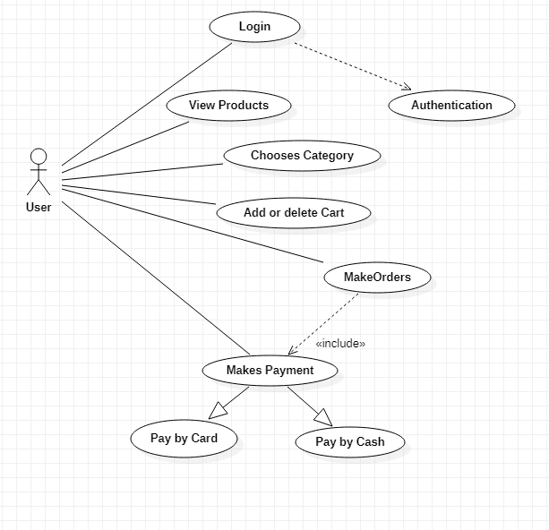
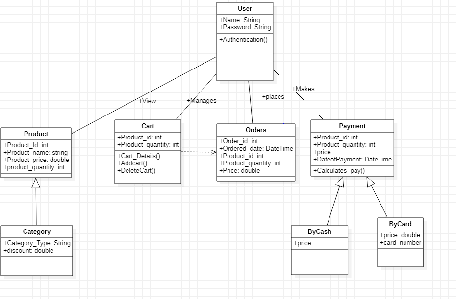

# DemoKart

# Introduction

The product/application will help users to search and buy products of there choicess sitting on one place with the help of internet running devices. There is cart inside the application where one can add there selected itmes and after that there are option of different types of payment methods for the user. 

# FEASIBILITY STUDY
# WHY-
In today's rush life there is need of such solution for the real time problems which saves times and physical work and make essentials more accessible.

# WHEN-
This application will be open and accessible 24X7 for every user where the delivery status passes.

# WHAT-
The product/application is a e-commerce application. Which will help users to search and buy products of there choicess sitting on one place with the help of internet running devices. There is cart inside the application where one can add there selected itmes and after that there are option of different types of payment methods for the user.

# WHERE-
This product/application will be used by any person who is in a need of any producy/item which they can buy online just with few clicks on the screen.

# HOW-
At first the user has to select the items that he/she wants to buy and they have to add the product in the cart. After adding to the cart, user needs to go to the payment option and then select the payment option that they will need to pay for the product they are buying.

# Swot Analysis: -
  # (i). Strengths   --
       1. It will be really helpful as home delivery of vast variety of products will be done by just fews clicks on the device screen.
       2. There is diverse products offering in the product list.
       3. There will be superior quality service.
       4. The service will be available all the time 24X7. 

 # (ii). Weakness   --
       1. The application is present only online.
       2. It will take few days for delivering the product.
       3. The application will not be globally present.
       4. Shipping costs on products with less price will be added to the total cost.

 # (iii). Opportunities   --    
       1. It will give the opportunity to expand the local buisness to a large scale.
       2. Rapid adoption of mobile application.

# (iv). Threats   --
      1. Online security threats is possible.
      2. Competition from famous online shopping sites.

# High-level-diagram: - 

   1. The user/actor first needs to sign in with there details in the application.
   2. After the sign in , the aunthentication process takes place.
   3. the user can view different products.
   4. Categories section is created where homogeneous products will be displayed.
   5. User can add or delete the products to the cart using product ID.
   6. After selecting the products there are two payment option either by cash or by card.

# Low-level-diagram: - 

